# Relay for Reddit — mobile nav & UX observations

**Source:** `relay-demo.mp4` — a 54.6 s Android screen recording (1080×2400). The full clip and the complete
2 fps extraction (109 frames) are kept locally in `design-ref/reddit-app-study/` (git-ignored — regenerate via
ffmpeg), not committed. The [`frames/`](frames/) beside this doc holds only the curated subset embedded below;
frame *N* ≈ timestamp **(N−1)/2 s**.

**How this was built:** 6 perspective-diverse analysis agents read the full-res frames (one lens each:
navigation, feed density, swipe gestures, sort/filter/search, detail view, visual design); every claimed
feature was adversarially re-checked against its cited frames (54 confirmed, 9 rejected); a completeness
critic swept for missed screens. I then personally re-verified a spread of frames against every claim.

> ### ⚠️ Two things to know before you read
> 1. **This whole clip is _Relay for Reddit_ — _Sync never appears on screen._** (Brand "RelayForReddit"
>    is visible in the search results at frame 50; the recorder pill is constant throughout.) The density
>    differences you'll see (compact vs full card, thumbnail left vs right) come from **Relay's own Layout
>    options**, not a switch to Sync. If you want Sync patterns too, a second clip would cover those.
> 2. **`frame_109` is the Android "Stop recording?" system dialog**, not an app screen — excluded below.

---

## How to use this doc

Each feature is **numbered** with an embedded reference frame, what it does, and a first-pass mapping to
content-hoarder. **Reply with the numbers you want** (e.g. "1, 2, 10, 12, 26") — or whole categories
("all of A and B") — and I'll turn the picks into a design + implementation plan on a fresh
`feat/restore-sidebar-nav` branch off `staging`. Picks ≠ commitment to copy 1:1; they tell me what to design around.

---

## The recording at a glance (0 → 54 s)

| Time | What happens |
|---|---|
| 0–3 s | Scanning a **compact feed** (small left thumbnails, ~6 posts/screen). |
| 3–7 s | Opens the **source-jump sheet** — a search field + **Mine \| Search** tabs, a **Multireddits** group (Frontpage/Popular/All/Saved/Mod/Friends/Explore). |
| 7–9 s | The **left-edge account drawer** — destinations (Posts/Profile/Inbox/…/Settings) + a **Quick Settings** footer (Thumbnails-on-left, theme). |
| 9–14 s | Back in the feed; **swipe-left on a card** pulls a progressive colored action zone (Up → Down → Save) that **springs back**. Header collapses on scroll. |
| 17–18 s | A **Profile "Overview"** screen — the user's comments + posts interleaved; bottom bar morphs to Section/Unfriend. |
| 21–31 s | **Source search**: "Mine" type-ahead (`rela` → RelayForReddit) with favourite-stars, then the **Search** scope = global discovery (subscriber counts + ⊕ add). |
| 36–44 s | Feed in **full-card** layout; **open a post** (meirl) → detail **slide-up sheet** with a pinned action bar, big **circular stat-buttons** (95% Like It / 132 Comments / Reply / Top) + a FAB; back **restores scroll**. |
| 46–49 s | **Sort popup** from the bottom bar (Best/Hot/New/Rising/Top/Controversial) → **Top → time-range** submenu (Hour…All Time) → "**Top Week**" echoed in the header subtitle; reload keeps context. |
| 54 s | OS "Stop recording?" dialog (end of clip). |

---

## A. Navigation & source-switching
*The core replacement for the disliked tag-pill / `#tagsheet`.*

| Frame | Feature → content-hoarder |
|---|---|
| 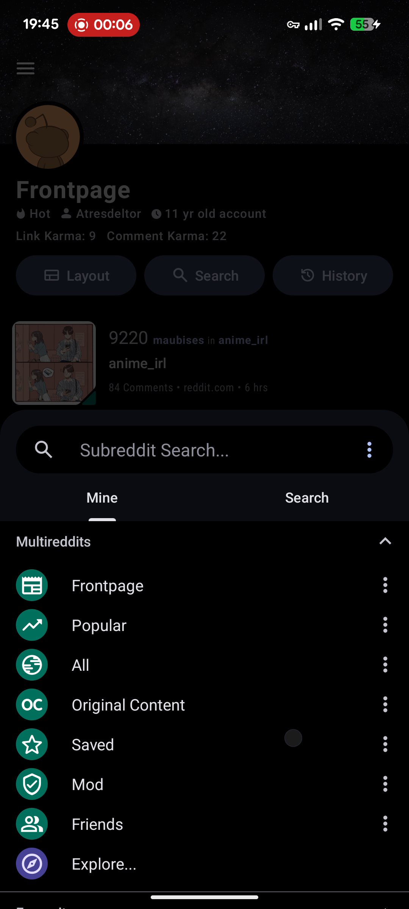 | **1. Source-jump sheet: persistent search field + `Mine \| Search` scope tabs** `[ ]` A single surface topped by a pill "Subreddit Search…" field with two underlined tabs — **Mine** (filter sources you already have) and **Search** (discover new ones). Body lists grouped sources. **→ CH:** *the* core ask — one fast sheet to jump between sources/tags. "Mine" filters your existing tags/sources; "Search" finds/adds new. frame 013 · t≈6 s |
| 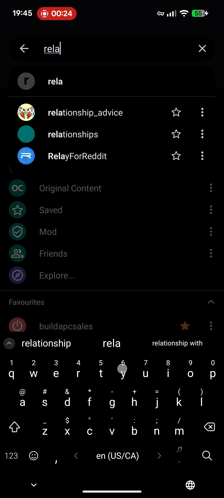 | **2. "Mine" live type-ahead over your own sources + star-to-favourite** `[ ]` Typing live-filters *your* subreddits per keystroke (`rela` → RelayForReddit). Each row: icon, name, ★ toggle, ⋮ overflow. **→ CH:** pivot to any tag/source in 2–3 keystrokes; ★ pins inline. frame 049 · t≈24 s |
|  | **3. "Multireddits" grouped section (aggregate/virtual feeds)** `[ ]` Collapsible group above raw sources: Frontpage, Popular, All, Original Content, Saved, Mod, Friends, Explore — teal icons, ⋮ overflow. **→ CH:** maps to **categories / folders / smart-views** (e.g. "All", "Saved", "To-triage"), grouped above individual sources/tags. frame 013 · t≈6 s |
| 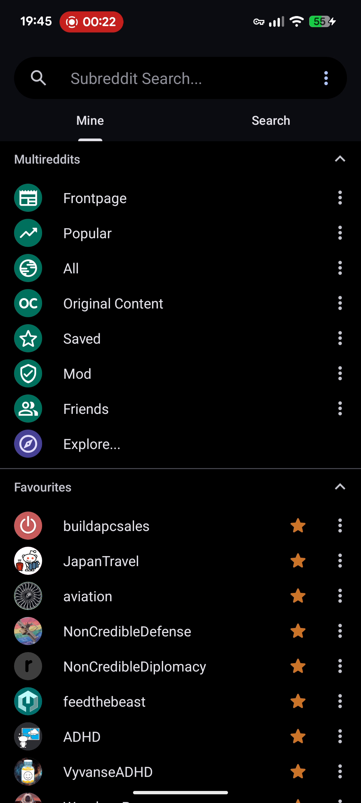 | **4. "Favourites" grouped section (pinned, starred)** `[ ]` A separate collapsible group of pinned subreddits with filled-gold ★ toggles + ⋮. **→ CH:** a **Pinned tags/sources** group for your most-jumped-to scopes. frame 046 · t≈22.5 s |
| 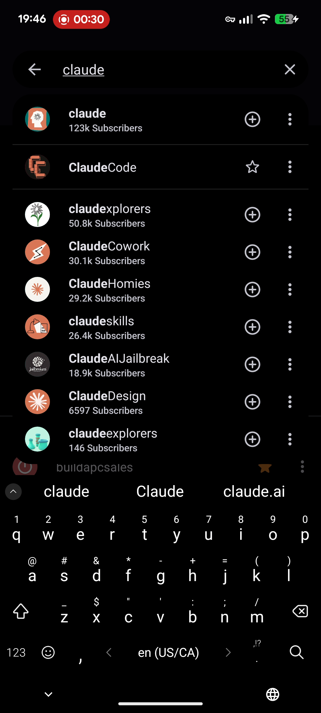 | **5. "Search" scope = global discovery (subscriber counts + ⊕ add)** `[ ]` Switching to Search shows global results: avatar, name (match bolded), count subtitle, circular **⊕** add, ⋮. **→ CH:** discover/add vs jump — count≈item-count, ⊕ = add-to-hoard, ★ = already-tracked. frame 061 · t≈30 s |
| 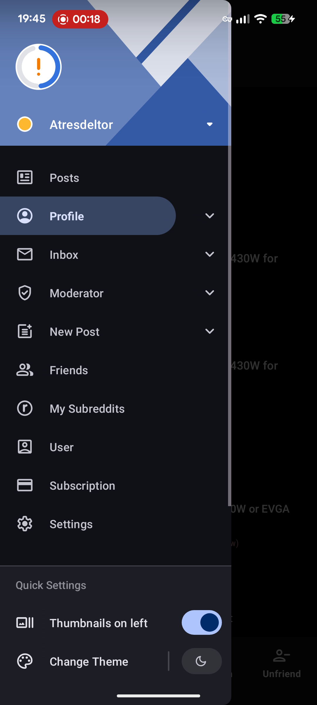 | **6. Left-edge account drawer (hamburger + edge-swipe, dims feed)** `[ ]` A Material drawer slides in from the **left** (~70% width), dimming the feed rather than navigating away; colored identity banner on top. **→ CH:** the structural replacement for the tag-pill — feed stays in place behind it. frame 037 · t≈18 s |
|  | **7. Drawer destination list w/ active rounded-pill highlight** `[ ]` Dense list (Posts/Profile/Inbox/Moderator/New Post/Friends/My Subreddits/User/Subscription/Settings); the active item is a filled-blue pill, some rows have expand chevrons. **→ CH:** model for top-level destinations (Inbox/Triage, Saved, All items, by-source, Settings). frame 037 · t≈18 s |
| 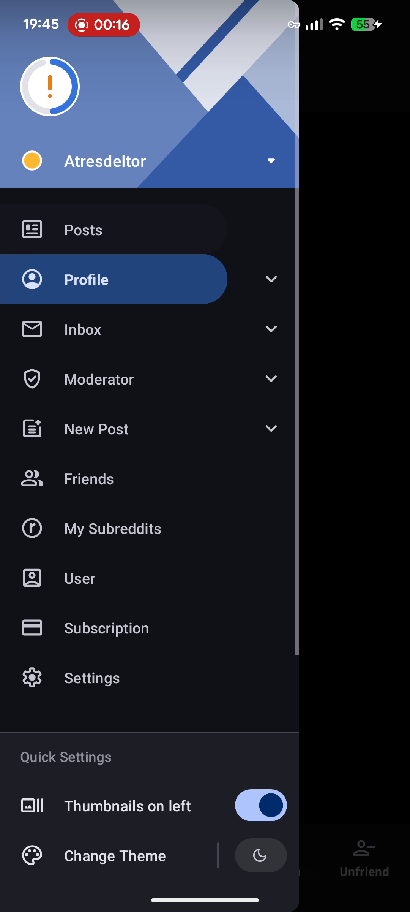 | **8. Drawer account-header + switcher dropdown** `[ ]` *(completeness pass)* Top of the drawer: avatar, name, right-edge ▾ chevron (account switcher). **→ CH:** single-user, but a strong slot for a **profile/stats summary** (total hoarded, #to-triage, streak) or a **view switcher** (Inbox ▾ Archive ▾ smart-feed). frame 034 · t≈16.5 s |
| 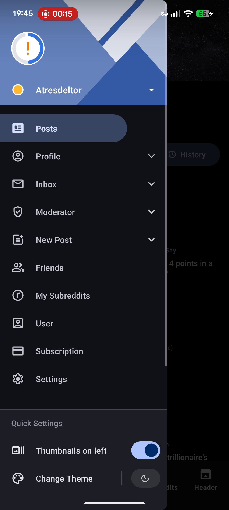 | **9. Drawer "Quick Settings" footer (Thumbnails-on-left + Change Theme)** `[ ]` *(completeness pass)* A pinned bottom block with the 1–2 most-flipped settings as inline toggles. **→ CH:** surface high-frequency toggles (density, NSFW-hide, theme) in the drawer footer; keep the full Settings sheet for the rest. frame 032 · t≈15.5 s |

## B. Swipe gestures & triage actions
*The single fastest triage primitive in the whole clip.*

| Frame | Feature → content-hoarder |
|---|---|
| 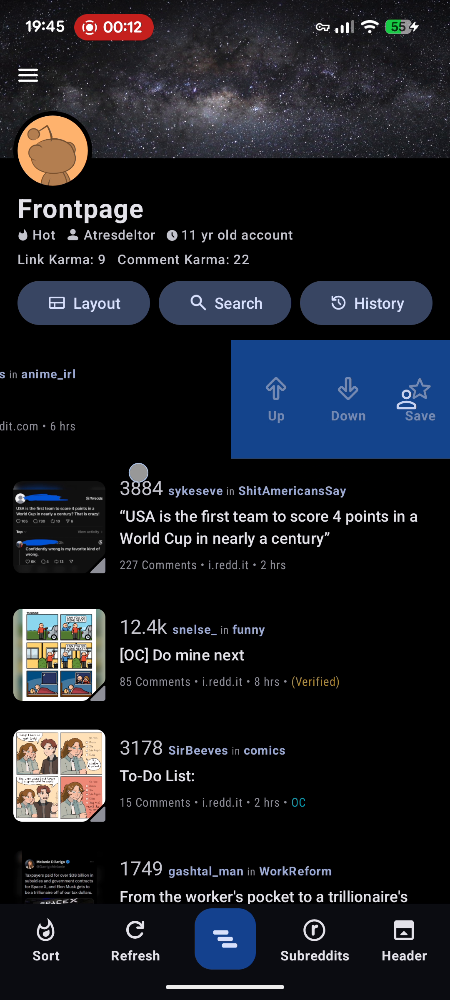 | **10. Swipe-left peek with progressive distance-threshold actions** `[ ]` Dragging a card **left** pulls a colored zone that grows through thresholds — short = **Up** (red), deeper = **Down** (purple), deepest = a **Up · Down · Save** row (blue). A short flick hits the nearest action; a longer drag selects from the set. **→ CH:** replace per-item tap-menus with a swipe-left peek surfacing triage verbs (**Keep / Archive / Delete**). frame 025 · t≈12 s |
|  | **11. Spring-back "peek" (row never stays open; fires on release)** `[ ]` After revealing the zone, the card animates back to full-width resting; the action commits on release — no half-open rows left behind. **→ CH:** one committed gesture that pairs naturally with the existing **undo snackbar**. frame 025 · t≈12 s |

## C. Sort, filter & search
*Thumb-anchored controls instead of heavy sheets.*

| Frame | Feature → content-hoarder |
|---|---|
| 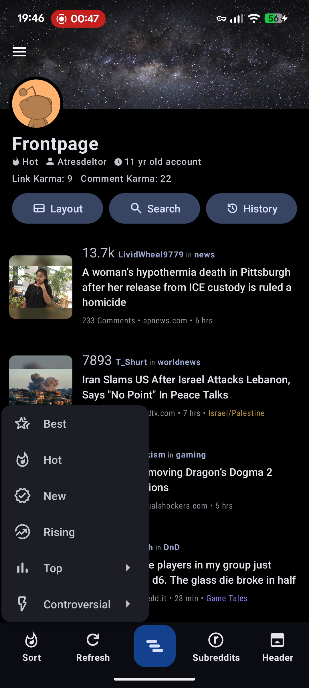 | **12. Sort popup anchored from the bottom bar** `[ ]` Tapping **Sort** raises a compact lower-left popup: Best, Hot, New, Rising, Top ›, Controversial ›. Selecting re-sorts immediately. **→ CH:** a thumb-reachable sort popup; modes map to triage/recency axes in two taps. frame 095 · t≈47 s |
| 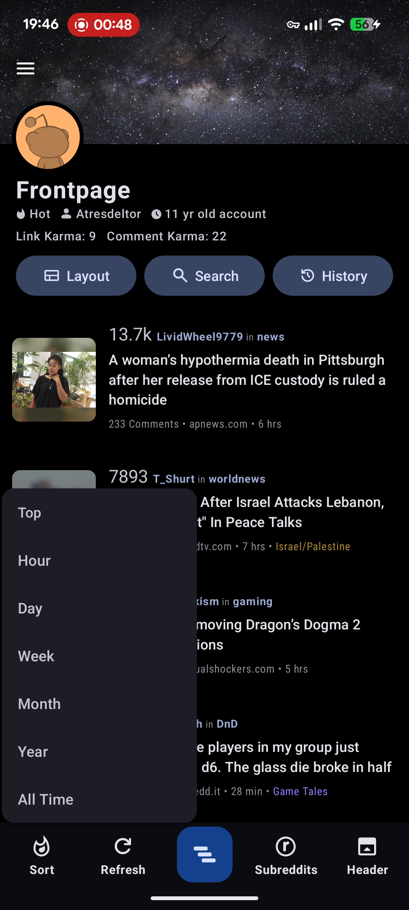 | **13. Two-level sort drill: Top → time-range submenu** `[ ]` Choosing **Top** opens Hour/Day/Week/Month/Year/All-Time; picking one reloads. **→ CH:** mirror for time-bounded views ("saved this week"). frame 097 · t≈48 s |
|  | **14. Active sort/range echoed in the header subtitle** `[ ]` The header shows the current sort as a breadcrumb under the source name ("Hot" → "Top Week"). **→ CH:** the header *is* the status line — show the active hoard sort/filter there. frame 098 · t≈48.5 s |
|  | **15. Explicit one-tap Refresh in the bottom bar** `[ ]` A circular-arrow Refresh sits beside Sort. *(A pull-to-refresh drag was not captured on camera.)* **→ CH:** an explicit Refresh matters for a sync-based PWA pulling new items on demand. frame 085 · t≈42 s |
| 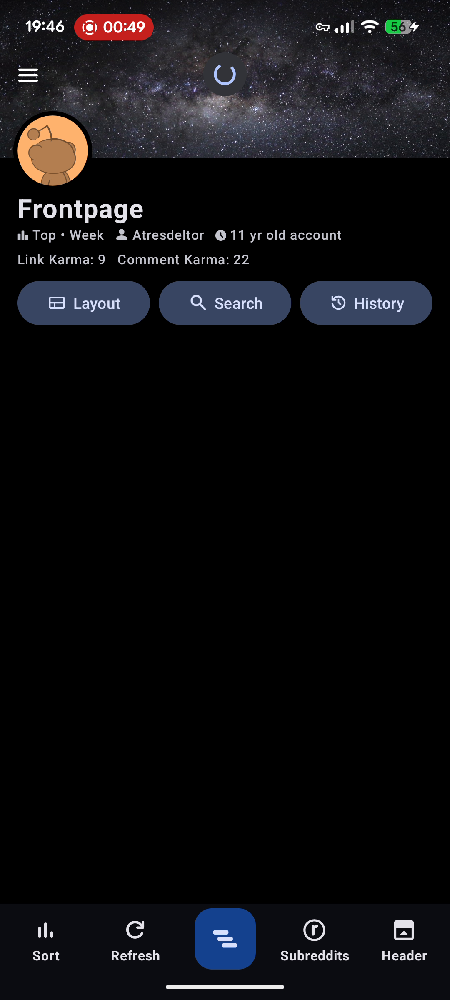 | **16. Context-preserving reload (label stays, list shows a spinner)** `[ ]` On a sort change the list clears to a header-anchored spinner; the source/sort label never disappears. **→ CH:** keeps your place instead of a full skeleton flash *(complements the recent "no skeleton flash on refetch" work)*. frame 100 · t≈49.5 s |
| 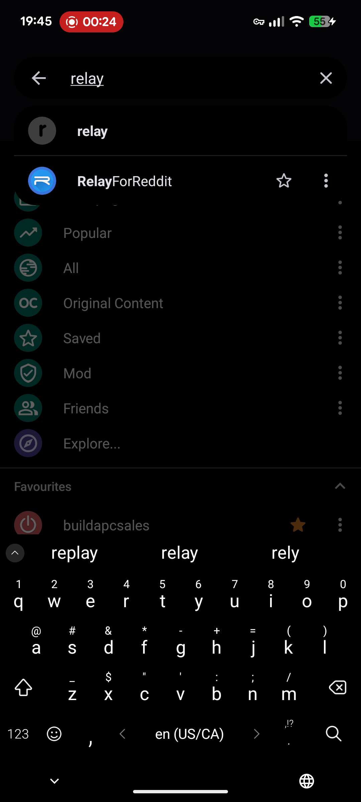 | **17. Live keyboard search state: type-ahead row + top-match w/ ★/⋮** `[ ]` *(completeness pass)* Focusing the field raises the keyboard + back-arrow/clear-X; typing shows an autocomplete row and a highlighted top result you can ★-favourite or act on without leaving the flow; the Mine/Favourites list stays dimmed behind. **→ CH:** the exact fast-jump mechanism to replace the tag-pill — focus one field, type, act inline. frame 050 · t≈24.5 s |

## D. Feed density & layout

| Frame | Feature → content-hoarder |
|---|---|
| 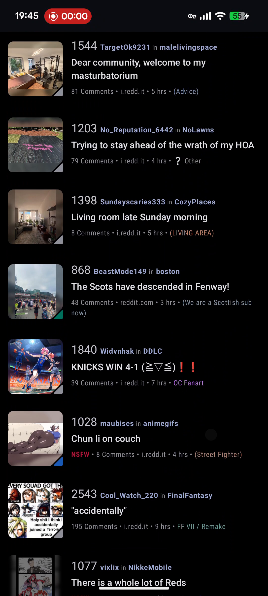 | **18. Compact rows, small LEFT thumbnail (~5–6 posts/screen)** `[ ]` ~64 px thumbnail pinned left, text to its right; a looser full-card mode also appears (frame 88). **→ CH:** left-thumbnail compact rows maximize items-per-screen for fast triage scanning. frame 001 · t≈0 s |
| 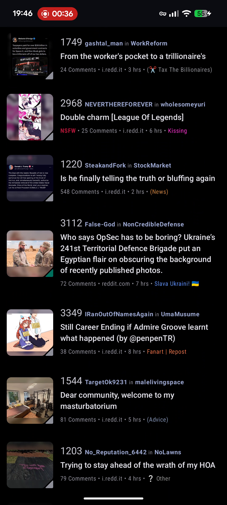 | **19. Title-dominant 3-tier metadata stack** `[ ]` Line 1: score + author·subreddit (accent link). Line 2: title (white, dominant). Line 3: N-Comments · **domain** · age · optional flair. **→ CH:** source pill, muted author, big title, footer of count/domain/age/flair — **domain inline is key for link & YouTube items**. frame 073 · t≈36 s |
|  | **20. Inline flair chips + red NSFW badge + self-text corner glyph** `[ ]` Small colored tags at the metadata-line tail; NSFW gets a distinct red badge; text/self posts show a folded-corner triangle on the thumbnail. **→ CH:** tags as color-coded inline chips, NSFW red *(ties into the new NSFW-hide toggle)*, plus a corner glyph for item **type**. frame 001 · t≈0 s |
| 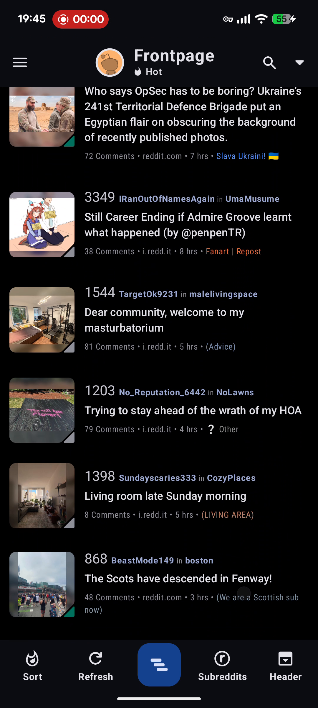 | **21. Collapse-on-scroll header → slim bar** `[ ]` Scrolling collapses the tall banner to a slim bar (avatar, source+sort, search, ▾). **→ CH:** reclaim vertical space while triaging. frame 002 · t≈0.5 s |
|  | **22. Flat true-black borderless list + semantic-accent palette** `[ ]` Near-black bg, **no card containers/borders/shadows**; selected row = dark-blue highlight. Palette: blue primary; semantic accents (red = like/NSFW, teal/green = group/reply, purple = sort, gold = star/score); monoline icons; rounded pills/FABs. **→ CH:** adopt true-black bg, one blue primary, a small semantic-accent set, monoline icons. frame 085 · t≈42 s |
|  | **23. Layout density toggle (header pill) + Thumbnails-on-left quick toggle** `[ ]` A "Layout" pill in the header for density + the drawer's Thumbnails-on-left toggle. *(The Layout pill itself isn't tapped on camera.)* **→ CH:** a density lever + thumbnail-placement toggle without a Settings round-trip. frame 034 · t≈16.5 s |

## E. Header chrome & bottom action bar

| Frame | Feature → content-hoarder |
|---|---|
|  | **24. Persistent 5-slot bottom action bar** `[ ]` Fixed bar: **Sort · Refresh · (raised center) · Subreddits · Header**. It's an *action bar*, not a tab bar — labels morph per screen (e.g. Section/Unfriend on a profile). **→ CH:** put section-nav in the drawer; reserve a slim bottom bar for **feed-context verbs** (sort, refresh, jump-sources, view options). frame 085 · t≈42 s |
|  | **25. Expandable header shortcut row (Layout/Search/History) + full↔compact toggle** `[ ]` Three pill chips under the banner, toggled by the **Header** button, which also swaps the tall banner for a compact bar (only the compact one exposes the hamburger). **→ CH:** per-feed quick controls + a density lever (compact header for triage mode). frame 076 · t≈37.5 s |

## F. Post & detail view

| Frame | Feature → content-hoarder |
|---|---|
| 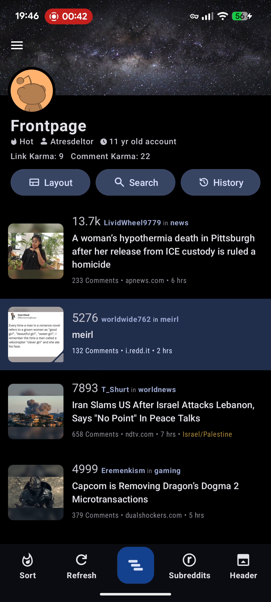 | **26. Open-from-feed: detail slides up as a sheet; back restores scroll + selection** `[ ]` Tapping a row opens a detail+comments **slide-up sheet** (grabber pill); dismissing returns to the **same scroll position with the row still highlighted**. **→ CH:** preserving feed scroll + selection on return is critical for an **open → act → dismiss → next** triage loop. frame 086 · t≈42.5 s |
| 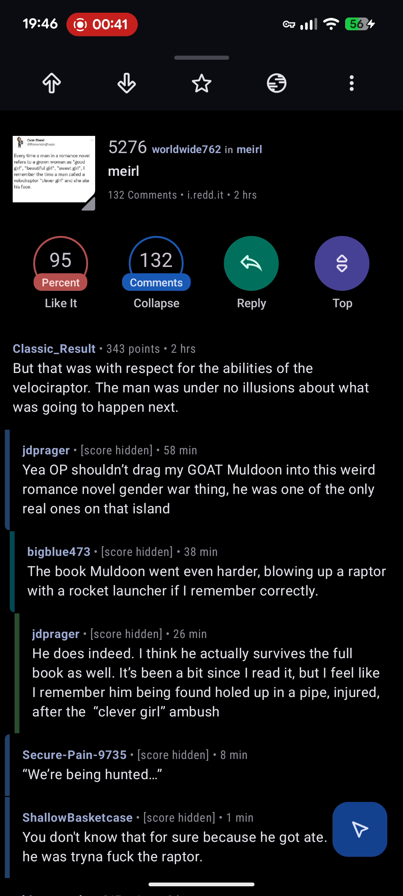 | **27. Pinned top action bar in the opened post** `[ ]` Slim top bar: upvote, downvote, ★ save, share, ⋮ — with a read-progress line beneath and a grabber pill above. **→ CH:** pin a slim action bar (archive/save, tag, share, overflow) in the item view. frame 083 · t≈41 s |
|  | **28. Compact post card repeated at top of detail** `[ ]` The opened post repeats its feed card (thumbnail, score, author, subreddit link, title, meta) at the top of the detail. **→ CH:** reuse the item card atop the detail; its chips jump to that source. frame 081 · t≈40 s |
| 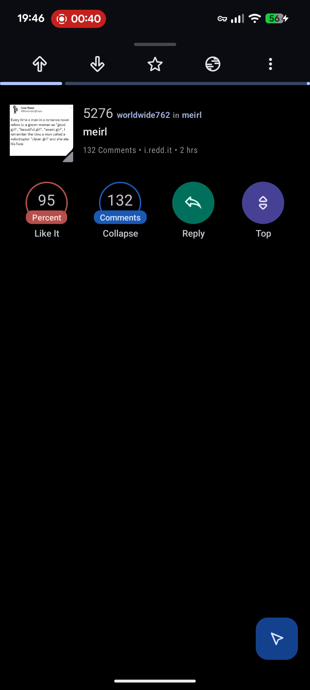 | **29. Large color-coded circular stat/action buttons + persistent FAB** `[ ]` Four big circular buttons — red **95% Like It**, blue **132 Comments/Collapse**, green **Reply**, purple **Top** (comment-sort) — and a blue FAB that persists as comments scroll. **→ CH:** stat-buttons map to item metadata + actions; the **FAB = next-item** affordance for a triage queue. frame 082 · t≈40.5 s |

## G. Profile / per-source drill-down

| Frame | Feature → content-hoarder |
|---|---|
| 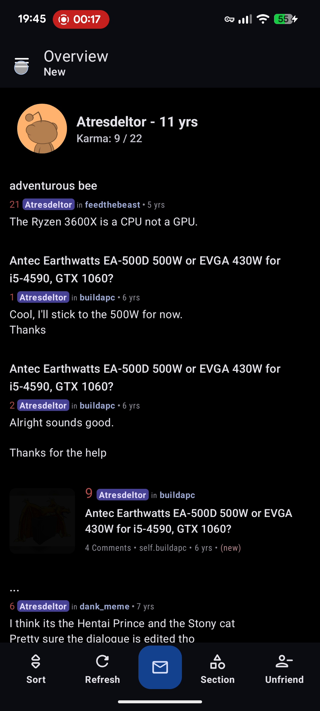 | **30. Profile "Overview": interleaved comments+posts + context bottom bar** `[ ]` *(completeness pass)* A distinct full screen (not the detail sheet): a profile header card over a single chronological stream that **interleaves the user's comments and posts**, each with its own context ("… in feedthebeast 5 yrs"). The bottom bar **re-skins** to Sort/Refresh/✉/**Section**/**Unfriend**. **→ CH:** reuse **one feed shell** but swap the bottom bar's verbs per context (a tag/source page → Sort/Refresh + "Sections" item-type filter + a context action). The mixed comments+posts stream maps to a **mixed-type hoard view** (Reddit/YouTube/link items in one stream with per-row type context). frame 036 · t≈17.5 s |

---

## Excluded
- **`frame_109` — "Stop recording?"**: the Android system screen-recorder dialog, not an app pattern. Listed only so it isn't mistaken for an in-app confirmation to copy.

## My read on the highest-leverage picks (for the tag-pill replacement)
Not a decision — just where I'd start if you want a steer: **1–2 + 17** (the search-field + Mine/Search type-ahead source jump) is the most direct answer to "too many taps, hinders idea-jumping"; **3–4** (Multireddits/Favourites grouping) gives categories a home; **10–11** (swipe-left peek) is the fastest triage primitive; **24** (slim bottom action bar) + **6** (left drawer) reframe the chrome. Tell me your numbers and I'll design from there.
