# Sync for Reddit — mobile nav & UX observations

**Source:** `sync-demo.mp4` — a 120 s Android screen recording (1080×2400). The full clip and the complete
2 fps extraction (240 frames) are kept locally in `design-ref/reddit-app-study/` (git-ignored — regenerate via
ffmpeg), not committed. The [`sync-frames/`](sync-frames/) beside this doc holds only the curated subset embedded
below; frame *N* ≈ timestamp **(N−1)/2 s**.

**How this was built:** 4 perspective lens agents (navigation/customization, feed layouts, swipe gestures,
detail/comments/media) read the full-res frames and returned frame-cited findings; I then personally
re-verified 18 frames against the claims (incl. every frame embedded below) before writing. This is the
companion to [`relay-observations.md`](relay-observations.md) — same structure, so the two can be compared
feature-for-feature.

> ### How Sync differs from Relay (at a glance)
> - **No bottom action bar.** Sort/Refresh/etc. live in the **top app-bar** + a floating **"•••" FAB** instead.
> - **No "Multireddits" group.** Sync groups the drawer as **Feeds** (Frontpage/All/Popular) + **Subscriptions**
>   (alphabetical), and lets you **show/hide whole groups** via "Section visibility".
> - **Customization is the headline.** The "**More actions**" grid is user-reorderable (hold-drag) and you pick
>   which actions show; the drawer's sections are user-toggleable. Relay had nothing equivalent.
> - **A real density spectrum.** "**Change view**" offers 6 layouts (List → Compact → … → Cards → Slides).
> - **Logged-out caveat:** the account was signed out, so swipe actions popped a "must be logged in" toast — but
>   the colored swipe zones still render fully, so the directions/colors below are reliable (they're Sync's defaults).
> - `frame_240` is the OS "Stop recording?" dialog — excluded.

---

## How to use this doc

Each feature is **numbered** with an embedded reference frame, what it does, and a content-hoarder mapping.
**Reply with the numbers you want** (e.g. "S1, S7, S17") — I prefix Sync items with **S** so they don't collide
with the Relay doc's numbers. The **third doc**,
[`content-hoarder-recommendations.md`](content-hoarder-recommendations.md), already synthesizes the best of
*both* apps into a prioritized build list — start there if you'd rather pick from a merged menu.

---

## The recording at a glance (0 → 120 s)

| Time | What happens |
|---|---|
| 0–5 s | **Nav drawer** open — Add-account header, Submit/Settings/Get Sync Ultra, in-drawer Search, **Feeds** + **Subscriptions** groups. |
| 5–8 s | Tap a video card → **fullscreen video player** (scrubber, HD, timecode). |
| 9–15 s | **Cards** feed; **swipe a card right** (orange ↑) and **left** (purple ↓ → red ✕ hide). |
| 15–30 s | Open a video post → detail + comments; switch feed (All); back to drawer / in-drawer search. |
| 34–50 s | Feed; **top-bar overflow menu** (Section visibility, Remember position, Expand on open…) + the **Section-visibility** submenu. |
| 50–67 s | **"More actions"** customizable grid (via the FAB) → **"Change view"** picker → switch density (Cards → Small cards → Compact). |
| 67–95 s | Feed in varying densities; media. |
| 95–119 s | Open a post → **detail action bar** + long **comment thread** (nesting, "View more", "[deleted]", pinned auto-mod); **comment swipe** (orange ↑ → yellow save → green reply). |
| 120 s | OS "Stop recording?" dialog (end). |

---

## A. Navigation & source-switching (the drawer)
*Sync's answer to "jump idea-to-idea": a grouped, searchable, user-prunable drawer.*

| Frame | Feature → content-hoarder |
|---|---|
| 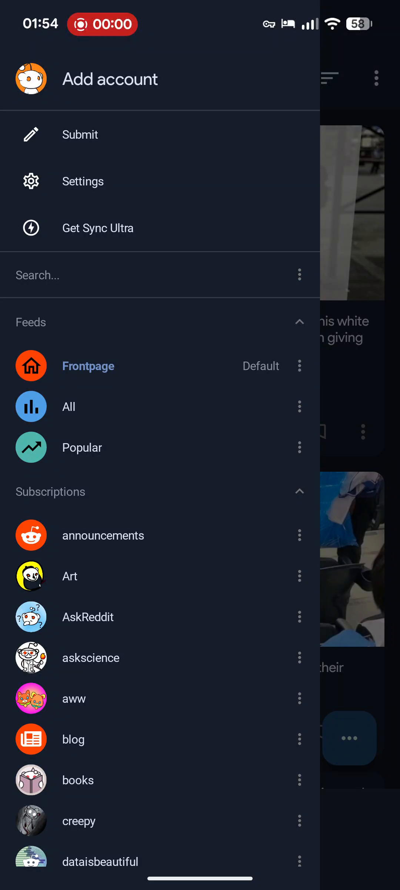 | **S1. Overlay nav drawer (one surface for everything)** `[ ]` A full-height left drawer over a dimmed feed: an **"Add account"** header, global rows **✏ Submit · ⚙ Settings · ⭐ Get Sync Ultra**, a pill **Search…** field, then two collapsible groups — **Feeds** and **Subscriptions**. **→ CH:** the structural replacement for the tag-pill — one drawer bundling global actions + search + grouped jump-targets, feed dimmed behind it. frame 001 · t≈0 s |
|  | **S2. "Feeds" group — fixed top-level views** `[ ]` Three rows with distinct colored icons: 🏠 **Frontpage** (with a grey "**Default**" badge), 📊 **All**, 📈 **Popular**; each has a trailing ⋮. Tapping switches the active feed + updates the header. **→ CH:** a small fixed set of pinned **smart views** (Inbox/Unread, All, To-triage, Popular) above the source list; the "Default" badge = your landing view. frame 001 · t≈0 s |
| 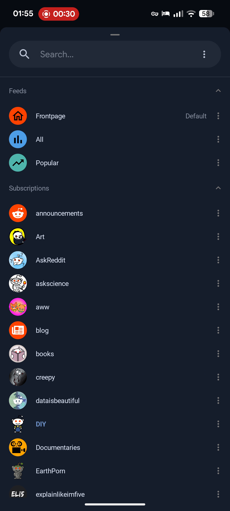 | **S3. "Subscriptions" — alphabetical source list** `[ ]` Long A→Z list; each row = **per-source colored avatar** + name + trailing ⋮. A scroll-to-top ▲ FAB appears when scrolled. **→ CH:** direct analog to the source/tag list — colored per-source icons aid fast visual scanning; A→Z + scroll-to-top is the "jump anywhere" affordance the tag-sheet lacks. frame 060 · t≈29.5 s |
| 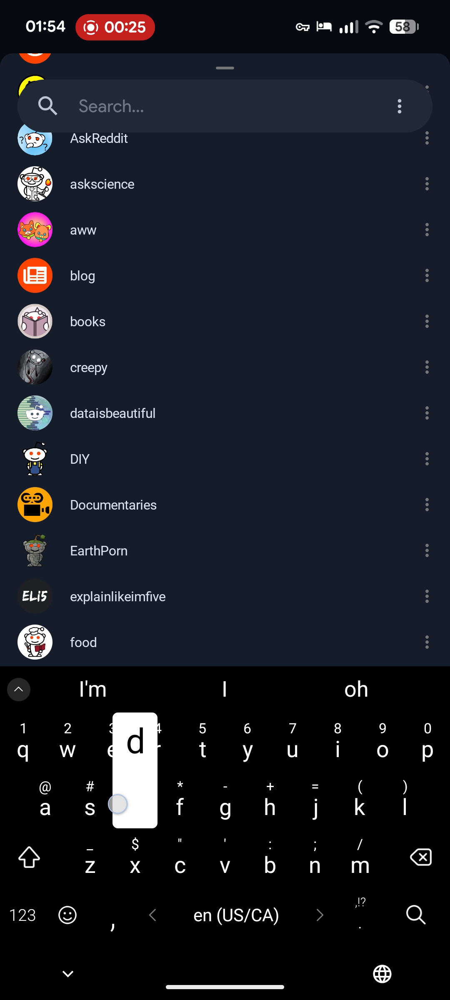 | **S4. Persistent in-drawer Search (live filter)** `[ ]` The pill search field sits at the top of the scroll area; tapping raises the keyboard and the source list filters live underneath — no separate screen. **→ CH:** the fastest "jump to any source/tag" path; keep search anchored in the nav so filtering never costs a navigation. frame 050 · t≈24.5 s |
|  | **S5. Per-row ⋮ overflow on every nav row** `[ ]` Each Feed/Subscription row carries its own trailing ⋮ separate from the tap target: tap row = navigate, tap ⋮ = row-scoped actions. **→ CH:** a per-source secondary-action channel (mute / pin / mark-read / recolor / change-state) in one tap — not buried in a sheet, no long-press needed. frame 060 · t≈29.5 s |
| 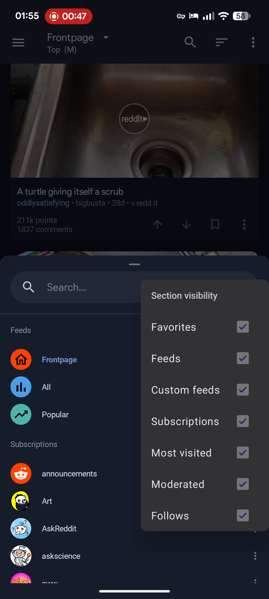 | **S6. "Section visibility" — prune the drawer itself** `[ ]` A checkbox submenu (Favorites / Feeds / Custom feeds / Subscriptions / Most visited / Moderated / Follows) that shows/hides **whole groups** of the drawer. **→ CH:** let users hide nav groups they don't use (Pinned / Recently-added / By-source / By-tag / Most-visited / Archived) — a strong "too many taps" answer: prune to only what you jump between. frame 095 · t≈47 s |

## B. Customization (Sync's signature)

| Frame | Feature → content-hoarder |
|---|---|
| 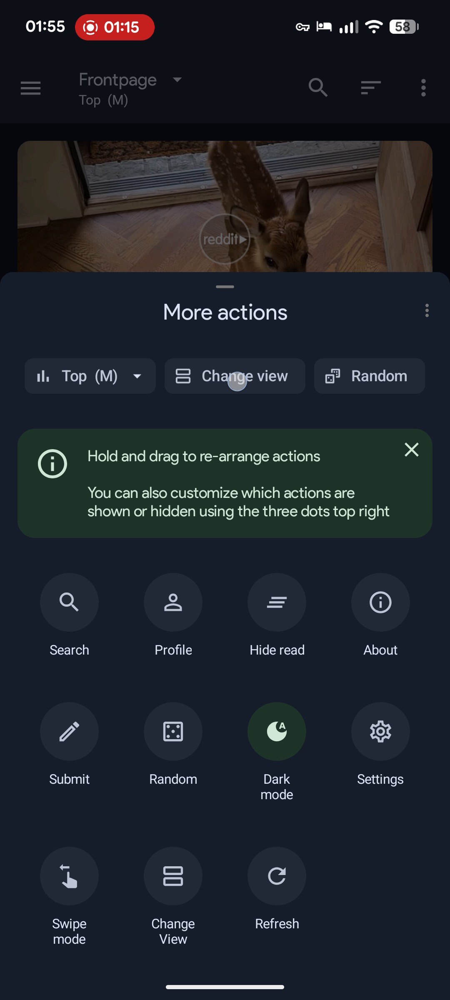 | **S7. "More actions" — customizable action grid** `[ ]` ⭐ The **"•••" FAB** opens a sheet: top pills (**Top (M) ▾** sort, **Change view**, **Random**), a green hint *"Hold and drag to re-arrange actions / customize which actions are shown or hidden using the three dots top right,"* then a 4-col grid (Search, Profile, Hide read, About, Submit, Random, **Dark mode** [active=green], Settings, Swipe mode, Change View, Refresh). **→ CH:** the single most directly applicable pattern — replace the tag-pill sheet with a grid where the user **pins their own triage verbs** (Archive/Snooze/Tag/Mark-read/Resurface) and hold-drags to reorder; active-state highlight = CH toggles (NSFW-hide, unread-only). frame 150 · t≈74.5 s |
| 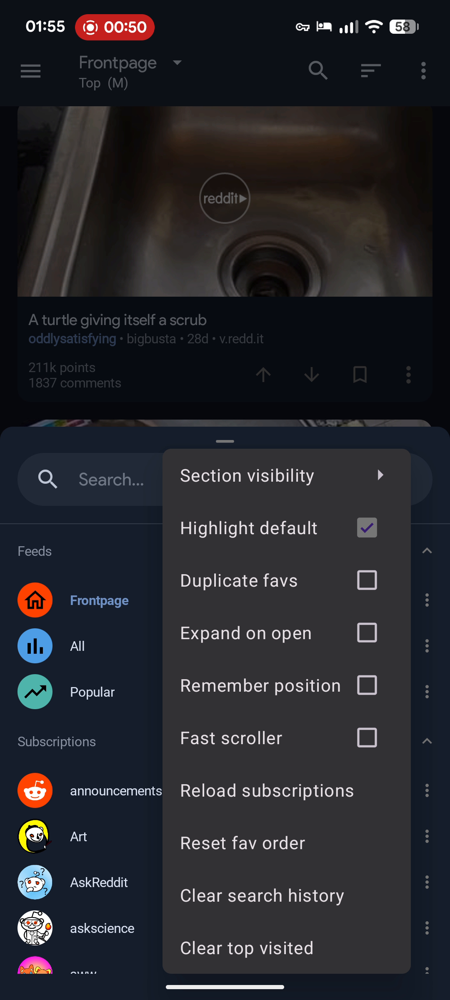 | **S8. Per-feed overflow menu (toggles + maintenance)** `[ ]` Top-bar ⋮ dropdown: checkbox toggles — **Highlight default**, Duplicate favs, **Expand on open**, **Remember position**, **Fast scroller** — then one-shots: Reload subscriptions, Reset fav order, Clear search history, Clear top visited. **→ CH:** a per-view settings menu mixing persistent toggles + maintenance commands. **"Remember position"** (resume scroll) and **"Fast scroller"** are high-value for a long hoard. frame 100 · t≈49.5 s |
| 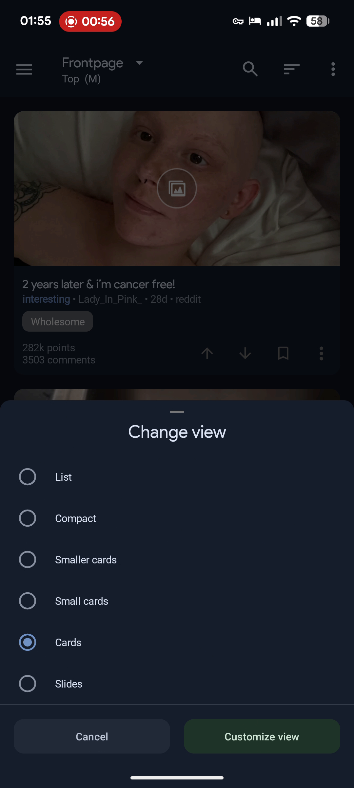 | **S9. "Change view" — density picker** `[ ]` Radio sheet: **List · Compact · Smaller cards · Small cards · Cards · Slides**, with **Cancel** + a green **"Customize view"** (per-field layout options). **→ CH:** one sheet to flip between dense **List/Compact** (triage many items) and **Cards** (browse/enjoy); "Slides" = a one-item-at-a-time focused triage mode. frame 113 · t≈56 s |

## C. Feed density & layout

| Frame | Feature → content-hoarder |
|---|---|
| 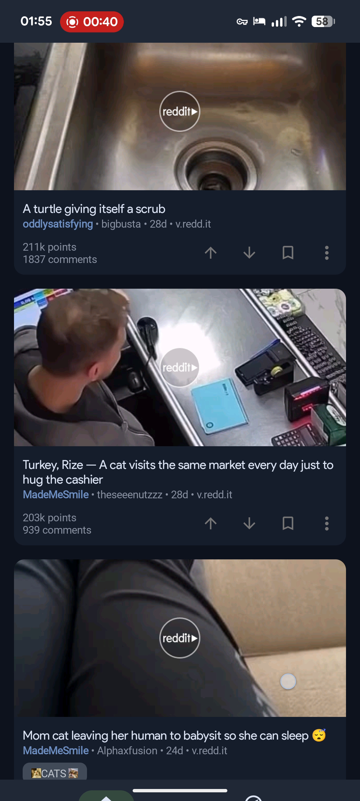 | **S10. "Cards" (default) — media-forward** `[ ]` Full-bleed media with rounded corners; video posts get a circular **"reddit ▶"** play overlay; below: title, **source · author · age · domain**, optional flair pill, score + comment count, and a right-aligned inline action row. **→ CH:** the "review/enjoy" density; the play-overlay convention = a glanceable **media-type** signal. frame 080 · t≈39.5 s |
| 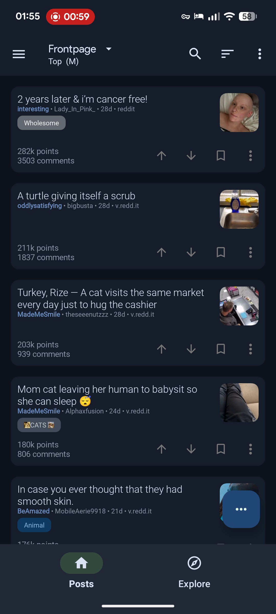 | **S11. "Small cards" — thumbnail-right** `[ ]` No full-bleed media; a small thumbnail on the **right**, text left-aligned (title, meta, flair, score/comments), with the **inline action row retained**. **→ CH:** a strong default middle ground — keeps per-item actions visible while showing ~5/screen. frame 118 · t≈58.5 s |
| 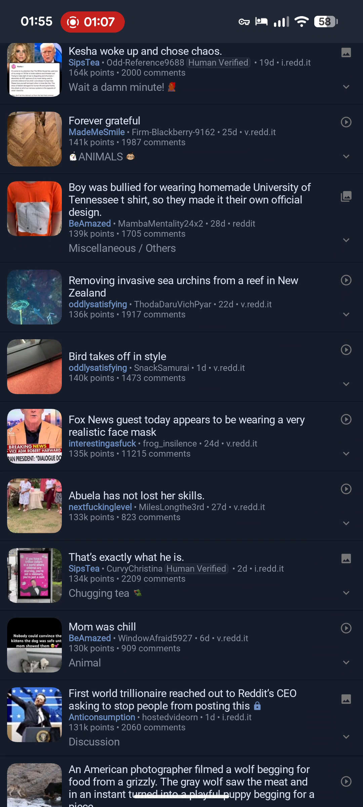 | **S12. "Compact" — dense scan list** `[ ]` Small **left** thumbnail, title, one muted meta line, a collapse chevron on the right; ~10–12 posts per screen. **→ CH:** the **triage/scan density** — bulk-process a backlog fast. The left-thumb + one-line-meta + chevron row is an efficient "process my saves" template. frame 135 · t≈67 s |
|  | **S13. Inline per-card action row** `[ ]` A right-aligned **↑ ↓ save ⋮** row on each card; the save bookmark fills when active. **→ CH:** the always-visible, non-gesture fallback for triage verbs — mirrors every swipe action so triage works without discovering gestures. frame 080 · t≈39.5 s |
| 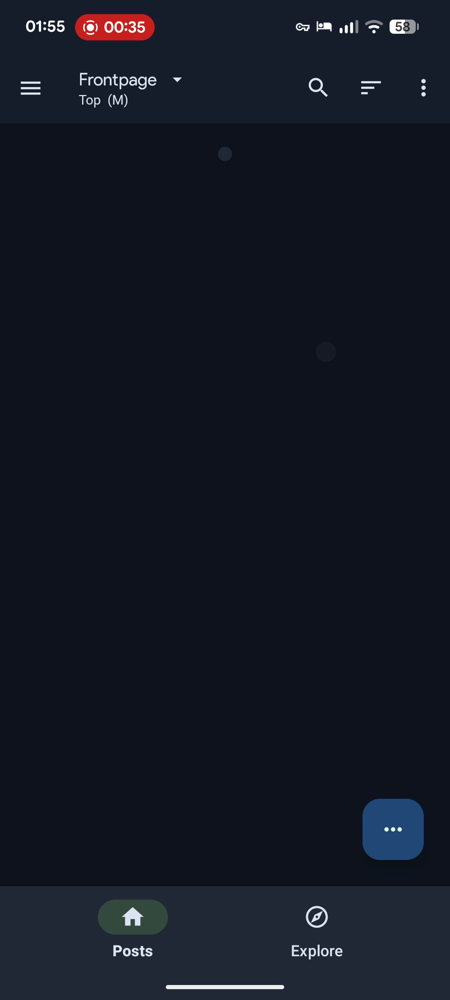 | **S14. Two-line pinned header (view + sort state)** `[ ]` Top app-bar: ☰, **"Frontpage ▾"** with a grey sort subtitle **"Top (M)"**, then search / sort / ⋮. Stays pinned on scroll. **→ CH:** "what am I looking at + how is it ordered" in one compact spot (e.g. "To-triage / Newest"); the ▾ is a drawer-free way to switch views. frame 070 · t≈34.5 s |
|  | **S15. Minimal 2-tab bottom bar (Posts / Explore)** `[ ]` Just two tabs — **Posts** (home, active = green pill) and **Explore** (compass). Hidden in detail views to maximize reading space. **→ CH:** a lean primary split (e.g. **Hoard** vs **Discover**); push density/sort/actions into sheets + the FAB, not the bottom bar. frame 070 · t≈34.5 s |
|  | **S16. Media-type badge on thumbnails** `[ ]` Video = the "reddit ▶" badge; image-only = a framed-photo glyph; so type is glanceable before opening. **→ CH:** badge saved-item type (video / image / link / YouTube) on the thumbnail — cheap, high-signal in a mixed-media hoard. frame 080 · t≈39.5 s |

## D. Swipe gestures & triage
*Color-coded, distance-based swipe actions — Sync's fastest triage primitive. (Colors = Sync defaults.)*

| Frame | Feature → content-hoarder |
|---|---|
| 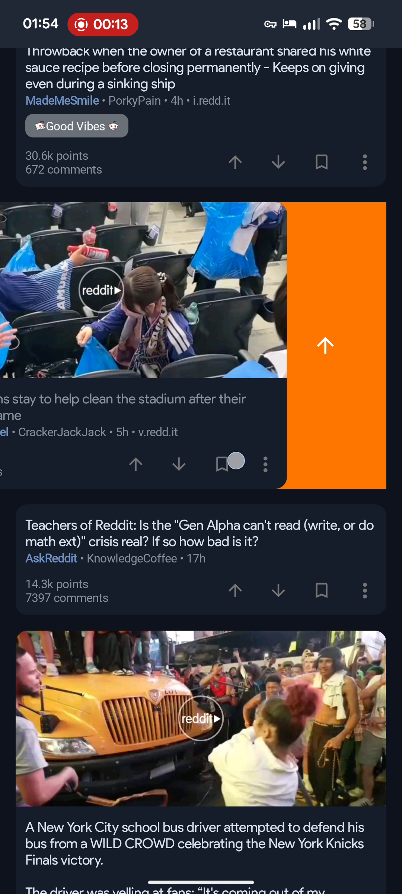 | **S17. Post swipe-RIGHT = orange upvote** `[ ]` Dragging a card right reveals an **orange** zone with a white **↑** on the left edge. **→ CH:** right-swipe = the positive verb (**Keep / Promote / Favorite**). frame 027 · t≈13 s |
| 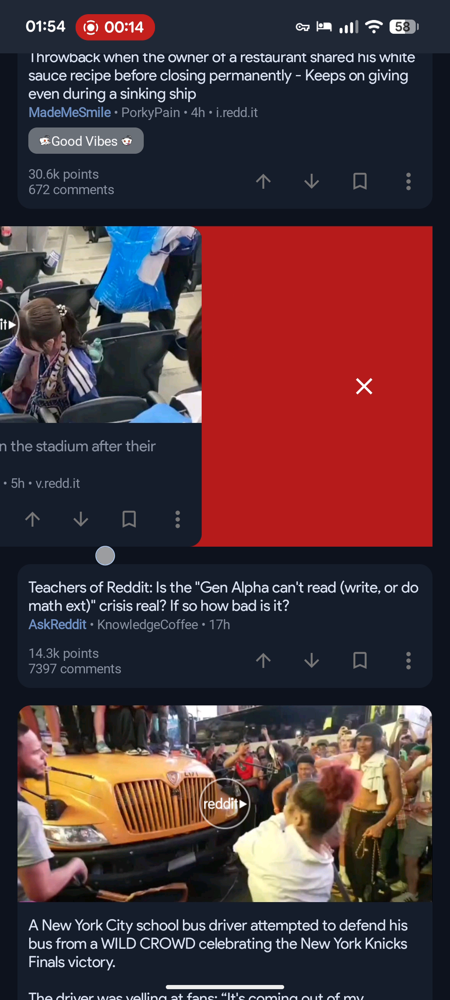 | **S18. Post swipe-LEFT = 2-stage (purple ↓ → red ✕ hide)** `[ ]` Short left = a **purple** zone with **↓** (downvote); a longer drag flips it to **red** with a white **✕** (hide/remove) — the icon swaps as you cross the distance threshold; card snaps back on release. **→ CH:** one left-drag with two thresholds — light flick = **Archive**, full swipe = **Delete/Dismiss** (red = destructive). frame 029 · t≈14.5 s |
| 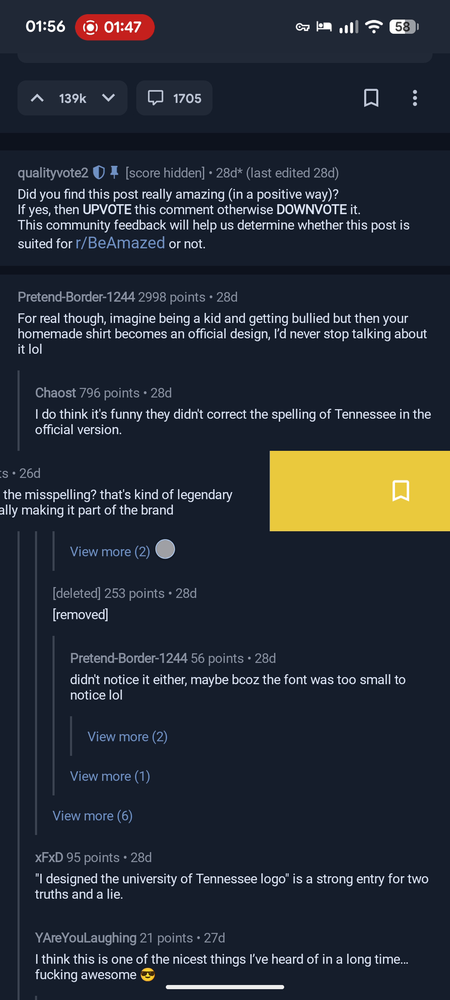 | **S19. Comment swipe = multi-band single drag (orange ↑ → yellow save → green reply)** `[ ]` ⭐ One continuous swipe passes through **distance bands**, each its own color+icon: orange **↑** upvote → **yellow** bookmark **save** → **green** reply. Continuous color feedback shows which verb will fire before release. **→ CH:** the strongest triage model — a single drag expressing **graded verbs** (light = Keep, medium = Tag/Save, far = Archive) with live color feedback. frame 215 · t≈107 s |
|  | **S20. "Swipe mode" + "Hide read" (first-class triage)** `[ ]` The actions grid includes a dedicated **Swipe mode** (whole list optimized for gestural triage) and **Hide read** (one-tap bulk-hide of already-seen posts). **→ CH:** a dedicated **triage mode** + a "**clear the done pile**" button (collapse items already Kept/Archived so only un-triaged remains). frame 150 · t≈74.5 s |

## E. Post detail, comments & media

| Frame | Feature → content-hoarder |
|---|---|
| 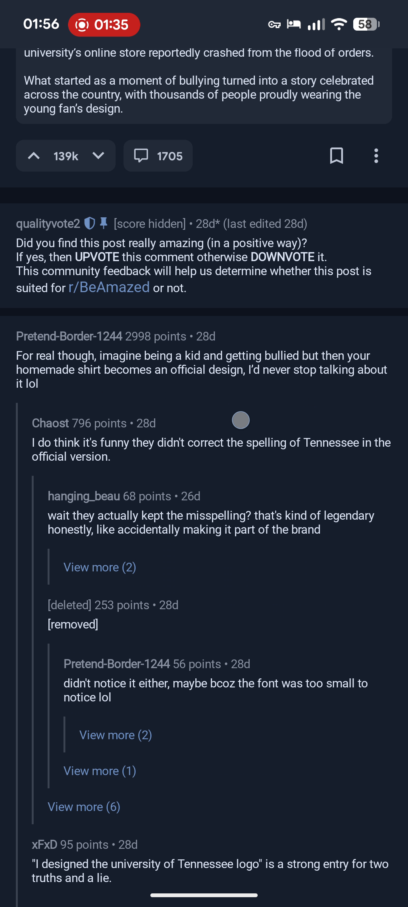 | **S21. Detail action bar + selftext-in-card** `[ ]` The opened post is a **routed full screen** (back ←, source-icon + name + sort header, no bottom tabs). Body sits in a darker rounded **selftext card**; the action bar = a grouped **score stepper pill (⌃ 139k ⌄)**, a **comment-count pill (💬 1705)**, save, ⋮. **→ CH:** item-detail as its own route (back restores feed scroll); grouped keep/archive stepper + meta pills + save/overflow is a compact item action bar. frame 191 · t≈95 s |
| 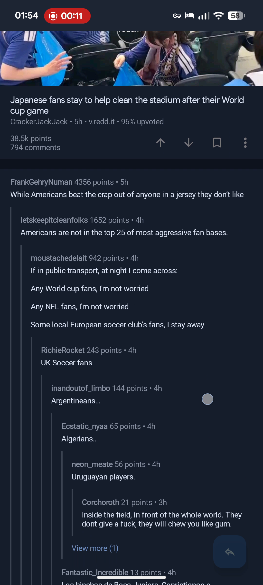 | **S22. Comment thread — depth rails, "View more", tombstones** `[ ]` Nested comments with **colored vertical depth rails** + indentation; each row **author · points · age**; truncated chains end in a blue **"View more (N)"**; removed content shows **"[deleted] … [removed]"** keeping its votes/age; pinned auto-mod sits in a highlighted box. *(Long-press a comment → a floating in-place toolbar: up/down/profile/collapse/reply/⋮ — frame 207.)* **→ CH:** "**Show N more**" with a count beats a bare "…" for collapsed clusters/duplicates; **"[deleted] but metadata persists"** is the model for CH's dead-link / removed-source **tombstones** (keep saved metadata, show a stub) — echoes the reddit-title-hydration "(untitled)/deleted" work. frame 022 · t≈10.5 s |
| 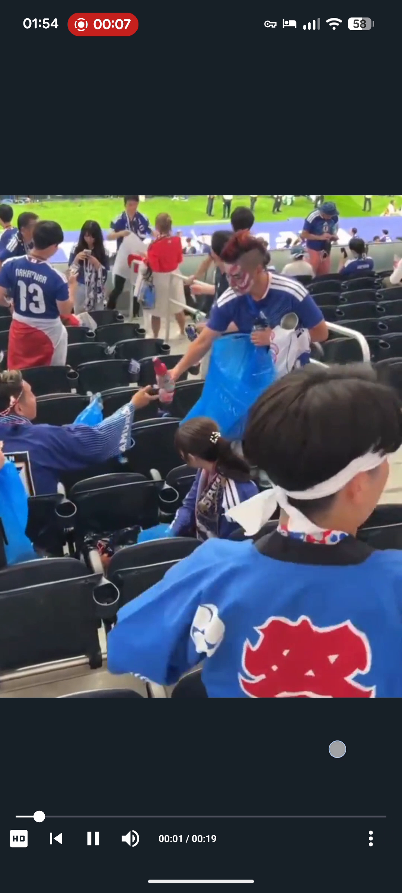 | **S23. Inline fullscreen media player** `[ ]` Tapping a video opens a full-bleed player: bottom control bar with **HD toggle, skip/play-pause/mute, elapsed/total timecode (00:01/00:19)**, draggable progress dot. *(Images open a swipe-to-dismiss fullscreen lightbox with an ✕ that restores scroll.)* **→ CH:** preview saved video/YouTube items in a full-bleed player with a minimal auto-hiding control bar; lightbox returns you to your exact scroll spot. frame 015 · t≈7 s |
|  | **S24. "Remember position" + "Expand on open" (scroll/media prefs)** `[ ]` Overflow toggles that (a) restore your prior scroll/read position on return, and (b) auto-expand media when a post opens. **→ CH:** **Remember position** = don't lose your place in a 1000-item hoard (complements the shipped "persist active view / no skeleton flash"); **Expand on open** = a preference for media-first vs metadata-first item open. frame 100 · t≈49.5 s |

---

## Excluded
- **`frame_240` — "Stop recording?"**: the Android system recorder dialog, not an app pattern.

## My read on the highest-leverage Sync picks
Not a decision — a steer: **S7** (customizable action grid) + **S6** (section-visibility-prunable drawer) are Sync's
unique contributions and map almost 1:1 to "kill the tag-pill, let me arrange my own jump/triage surface." **S19**
(multi-band swipe) is the best triage gesture across *both* apps. **S9 + S12** (density picker → Compact) give a
real "triage-fast" mode. See [`content-hoarder-recommendations.md`](content-hoarder-recommendations.md) for how
these combine with the Relay findings into a single build plan.
